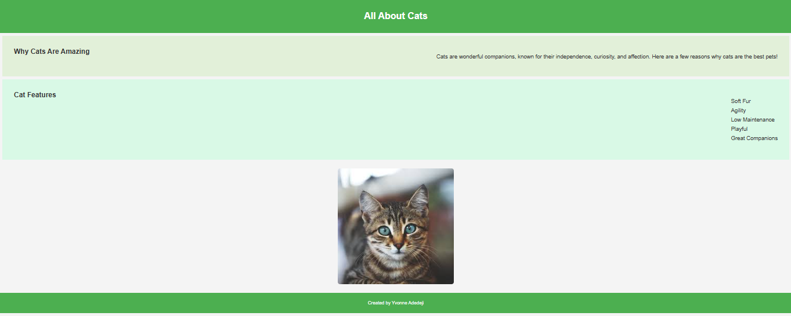

# responsive-design

## 📌 Description
This project is a simple, responsive webpage showcasing information about cats. It includes sections that describe why cats are amazing, highlight their features, and display an image of a cute cat. The webpage is built using HTML and styled with CSS to ensure it is visually appealing and user-friendly across different devices, from mobile to desktop.

## 🛠 Prerequisites
N/A

## 📋 Criteria
* The webpage should be responsive and adapt to different screen sizes (mobile, tablet, desktop).
* It should include an image of a cat and describe why cats make great pets.
* The webpage should be easy to navigate, with sections clearly labelled and visually distinct.

## 💻 Technologies Used
The application is built with the following technologies:
* HTML: For structuring the content of the webpage.
* CSS: For styling and making the page responsive with media queries.
* Responsive Design: Ensuring the page looks great on all screen sizes from mobile to desktop.
 
## 🚀 Installation
No installation is required to use the app. It is hosted online and can be accessed via a web browser.

## 📚 Usage
1. View the webpage on different devices or resize your browser window to see how it adapts to various screen sizes.
2. The webpage contains an introduction to why cats are great pets, a list of cat features, and an image of a cat.

## 🔗 Live Demo & Repository
Application can be viewed here: 
* [Live]https://yvonnesarah.github.io/responsive-design/)

* [Repository](https://github.com/yvonnesarah/responsive-design)

## 🖼 Screenshot
Below is a preview of Cats Responsive Design:

## 👥 Credit
N/A

## 📜 License
This project is open-source. For licensing details, please refer to the LICENSE file in the repository.

## 📬 Contact
You can reach me at 📧 yvonneadedeji.sarah@gmail.com.
